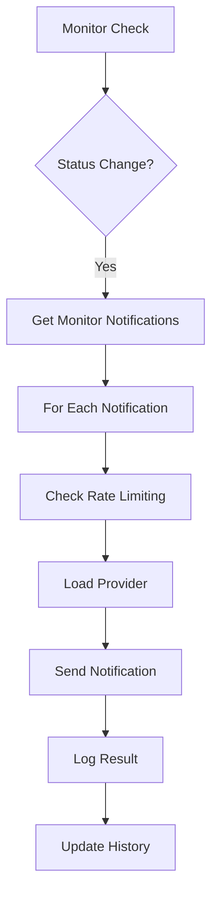

# Uptime Kuma Notification System - Comprehensive Analysis

## 🏗️ **Database Architecture**

## Major Categories:

Chat/Messaging: Telegram, Discord, Slack, Teams, Matrix, Mattermost, RocketChat, GoogleChat, Kook, Bale, Pumble, Stackfield, ZohoCliq

Mobile Push: Pushover, Pushbullet, Pushy, PushDeer, Bark, Gorush, TechPush, Webpush, Wpush, Spugpush, Pushplus

SMS Providers: Twilio, AliyunSMS, Cellsynt, ClickSendSMS, FreeMobile, GTXMessaging, PromoSMS, SerwerSMS, SevenIO, SMSEagle, SMSManager, SMSPartner, SMSIR, SMSPlanet, SMSC, 46elks

Email: SMTP, Brevo, SendGrid

Incident Management: PagerDuty, Opsgenie, Squadcast, AlertNow, GoAlert, Flashduty, Signl4, HeiiOnCall, Pagertree

Monitoring Integration: Alerta, Grafana, Splunk, Keep

Asian Platforms: Feishu, DingDing, WeCom, Line, LineNotify, Serverchan, Yzj

Specialized: Signal, Apprise, Ntfy, Gotify, Webhook, Nostr, Notifery, LunaSea, Nextcloud, HomeAssistant, CallMeBot, Threema, Whapi, Waha, Evolution, OneBot, OneChat, OneSender, Bitrix24, Octopush


### **Core Tables**

#### **1. `notification` Table**
```sql
CREATE TABLE notification (
    id INTEGER PRIMARY KEY AUTO_INCREMENT,
    name VARCHAR(255),                    -- Display name for notification
    active BOOLEAN DEFAULT TRUE,          -- Enable/disable notification
    user_id INTEGER,                      -- Owner of notification
    is_default BOOLEAN DEFAULT FALSE,     -- Default notification for new monitors
    config TEXT                           -- JSON configuration (provider-specific)
);
```

#### **2. `monitor_notification` Table (Many-to-Many)**
```sql
CREATE TABLE monitor_notification (
    id INTEGER PRIMARY KEY AUTO_INCREMENT,
    monitor_id INTEGER NOT NULL,          -- Foreign key to monitor
    notification_id INTEGER NOT NULL,     -- Foreign key to notification
    FOREIGN KEY (monitor_id) REFERENCES monitor(id) ON DELETE CASCADE,
    FOREIGN KEY (notification_id) REFERENCES notification(id) ON DELETE CASCADE
);
```

#### **3. `notification_sent_history` Table (Rate Limiting)**
```sql
CREATE TABLE notification_sent_history (
    id INTEGER PRIMARY KEY AUTO_INCREMENT,
    type VARCHAR(50) NOT NULL,            -- Notification type (UP/DOWN/CERT_EXPIRY)
    monitor_id INTEGER NOT NULL,          -- Monitor that triggered notification
    days INTEGER NOT NULL,                -- Day bucket for rate limiting
    UNIQUE(type, monitor_id, days)        -- Prevent duplicate notifications per day
);
```

## 🔧 **System Architecture**

### **1. Provider Registration System**
```javascript
// server/notification.js - Provider initialization
class Notification {
    static init() {
        this.providerList = {};
        
        const list = [
            new Telegram(),
            new Discord(),
            new Slack(),
            new SMTP(),
            new Webhook(),
            new Pushover(),
            new Gotify(),
            new Matrix(),
            new Teams(),
            new PagerDuty(),
            new Opsgenie(),
            new Pushbullet(),
            new Twilio(),
            new Signal(),
            new GoogleChat(),
            new Mattermost(),
            new RocketChat(),
            new Apprise(),
            new Ntfy(),
            new Line(),
            new LineNotify(),
            new Feishu(),
            new DingDing(),
            new WeCom(),
            new Bark(),
            new Pushy(),
            new PushDeer(),
            new Serverchan(),
            new Alerta(),
            new Grafana(),
            new Splunk(),
            new Squadcast(),
            new AlertNow(),
            new GoAlert(),
            new Flashduty(),
            new Keep(),
            new HeiiOnCall(),
            new Signl4(),
            new Pumble(),
            new Stackfield(),
            new Kook(),
            new Bale(),
            new Nostr(),
            new Notifery(),
            new LunaSea(),
            new Nextcloud(),
            new HomeAssistant(),
            new Webpush(),
            new Gorush(),
            new TechPush(),
            new OneBot(),
            new OneChat(),
            new OneSender(),
            new Whapi(),
            new Waha(),
            new Evolution(),
            new CallMeBot(),
            new Threema(),
            new ZohoCliq(),
            new Wpush(),
            new Spugpush(),
            new Pushplus(),
            new Pagertree(),
            new Octopush(),
            new Brevo(),
            new SendGrid(),
            new Bitrix24(),
            new Yzj(),
            new AliyunSMS(),
            new Cellsynt(),
            new ClickSendSMS(),
            new FreeMobile(),
            new GTXMessaging(),
            new PromoSMS(),
            new SerwerSMS(),
            new SevenIO(),
            new SMSEagle(),
            new SMSManager(),
            new SMSPartner(),
            new SMSIR(),
            new SMSPlanet(),
            new SMSC(),
            new Elks46()
        ];
        
        for (let item of list) {
            this.providerList[item.name] = item;
        }
    }
}
```

### **2. Base Provider Interface**
```javascript
// server/notification-providers/notification-provider.js
class NotificationProvider {
    name = undefined;  // Provider identifier
    
    // Main notification method - must be implemented
    async send(notification, msg, monitorJSON, heartbeatJSON) {
        throw new Error("Must override send() method");
    }
    
    // Template rendering for custom messages
    async renderTemplate(template, msg, monitorJSON, heartbeatJSON) {
        // Liquid template engine with context variables
    }
    
    // Proxy support for notifications
    getAxiosConfigWithProxy(axiosConfig) {
        // Handles NOTIFICATION_PROXY environment variable
    }
}
```

### **3. Notification Flow**



## 📨 **Provider Implementation Examples**

### **Telegram Provider**
```javascript
class Telegram extends NotificationProvider {
    name = "telegram";
    
    async send(notification, msg, monitorJSON, heartbeatJSON) {
        const params = {
            chat_id: notification.telegramChatID,
            text: msg,
            disable_notification: notification.telegramSendSilently,
            protect_content: notification.telegramProtectContent
        };
        
        if (notification.telegramUseTemplate) {
            params.text = await this.renderTemplate(
                notification.telegramTemplate, 
                msg, 
                monitorJSON, 
                heartbeatJSON
            );
        }
        
        await axios.post(
            `${url}/bot${notification.telegramBotToken}/sendMessage`, 
            params
        );
    }
}
```

### **Discord Provider**
```javascript
class Discord extends NotificationProvider {
    name = "discord";
    
    async send(notification, msg, monitorJSON, heartbeatJSON) {
        if (heartbeatJSON?.status === DOWN) {
            const embed = {
                title: `❌ ${monitorJSON.name} went down`,
                color: 16711680, // Red
                fields: [
                    { name: "Service Name", value: monitorJSON.name },
                    { name: "Error", value: heartbeatJSON.msg || "N/A" },
                    { name: "Time", value: heartbeatJSON.localDateTime }
                ]
            };
            
            await axios.post(notification.discordWebhookUrl, {
                username: "Uptime Kuma",
                embeds: [embed]
            });
        }
    }
}
```

## 🎯 **Configuration Management**

### **Notification Configuration Structure**
```javascript
// Stored in notification.config as JSON
{
    "type": "telegram",           // Provider name
    "name": "My Telegram Bot",    // Display name
    "isDefault": false,           // Apply to new monitors
    "applyExisting": false,       // Apply to existing monitors
    
    // Provider-specific configuration
    "telegramBotToken": "bot123456:ABC...",
    "telegramChatID": "-1001234567890",
    "telegramSendSilently": false,
    "telegramProtectContent": false,
    
    // Template support
    "telegramUseTemplate": true,
    "telegramTemplate": "🚨 {{name}} is {{status}}\nURL: {{hostnameOrURL}}",
    "telegramTemplateParseMode": "HTML"
}
```

### **Template Variables Available**
```javascript
const context = {
    // Status information
    status: "🔴 Down" | "✅ Up" | "⚠️ Test",
    name: "Monitor Name",
    hostnameOrURL: "https://example.com",
    
    // Full objects for advanced templating
    monitorJSON: { /* full monitor config */ },
    heartbeatJSON: { /* heartbeat details */ },
    msg: "Original message text"
};
```

## 🔄 **Notification Lifecycle**

### **1. Configuration Phase**
```javascript
// Save notification configuration
static async save(notification, notificationID, userID) {
    let bean = notificationID ? 
        await R.findOne("notification", "id = ? AND user_id = ?", [notificationID, userID]) :
        R.dispense("notification");
    
    bean.name = notification.name;
    bean.user_id = userID;
    bean.config = JSON.stringify(notification);
    bean.is_default = notification.isDefault || false;
    
    await R.store(bean);
    
    // Apply to existing monitors if requested
    if (notification.applyExisting) {
        await applyNotificationEveryMonitor(bean.id, userID);
    }
}
```

### **2. Trigger Phase**
```javascript
// In monitor heartbeat processing
if (statusChanged) {
    const notifications = await getMonitorNotifications(monitor.id);
    
    for (const notification of notifications) {
        try {
            await Notification.send(
                notification,
                message,
                monitorJSON,
                heartbeatJSON
            );
        } catch (error) {
            log.error("notification", `Failed to send: ${error.message}`);
        }
    }
}
```

### **3. Rate Limiting**
```javascript
// Prevent notification spam
const historyKey = `${notificationType}_${monitorId}_${dayBucket}`;
const exists = await R.findOne("notification_sent_history", 
    "type = ? AND monitor_id = ? AND days = ?", 
    [notificationType, monitorId, dayBucket]
);

if (!exists) {
    // Send notification and record history
    await sendNotification();
    await recordNotificationHistory();
}
```

## 🚀 **Implementation for Spring Boot + React + Agent Architecture**

### **1. Database Schema (Spring Boot)**

```sql
-- Notification providers table
CREATE TABLE notification_providers (
    id BIGINT PRIMARY KEY AUTO_INCREMENT,
    name VARCHAR(100) NOT NULL UNIQUE,
    display_name VARCHAR(255) NOT NULL,
    description TEXT,
    config_schema JSON,
    is_active BOOLEAN DEFAULT TRUE,
    created_at TIMESTAMP DEFAULT CURRENT_TIMESTAMP
);

-- User notification configurations
CREATE TABLE notification_configs (
    id BIGINT PRIMARY KEY AUTO_INCREMENT,
    user_id BIGINT NOT NULL,
    provider_name VARCHAR(100) NOT NULL,
    name VARCHAR(255) NOT NULL,
    config JSON NOT NULL,
    is_default BOOLEAN DEFAULT FALSE,
    is_active BOOLEAN DEFAULT TRUE,
    created_at TIMESTAMP DEFAULT CURRENT_TIMESTAMP,
    updated_at TIMESTAMP DEFAULT CURRENT_TIMESTAMP ON UPDATE CURRENT_TIMESTAMP,
    
    FOREIGN KEY (user_id) REFERENCES users(id) ON DELETE CASCADE,
    FOREIGN KEY (provider_name) REFERENCES notification_providers(name)
);

-- Monitor-notification associations
CREATE TABLE monitor_notifications (
    id BIGINT PRIMARY KEY AUTO_INCREMENT,
    monitor_id BIGINT NOT NULL,
    notification_config_id BIGINT NOT NULL,
    created_at TIMESTAMP DEFAULT CURRENT_TIMESTAMP,
    
    FOREIGN KEY (monitor_id) REFERENCES monitors(id) ON DELETE CASCADE,
    FOREIGN KEY (notification_config_id) REFERENCES notification_configs(id) ON DELETE CASCADE,
    UNIQUE KEY unique_monitor_notification (monitor_id, notification_config_id)
);

-- Notification history for rate limiting
CREATE TABLE notification_history (
    id BIGINT PRIMARY KEY AUTO_INCREMENT,
    monitor_id BIGINT NOT NULL,
    notification_config_id BIGINT NOT NULL,
    notification_type ENUM('UP', 'DOWN', 'CERT_EXPIRY', 'TEST') NOT NULL,
    status ENUM('SENT', 'FAILED', 'RATE_LIMITED') NOT NULL,
    message TEXT,
    error_message TEXT,
    sent_at TIMESTAMP DEFAULT CURRENT_TIMESTAMP,
    
    FOREIGN KEY (monitor_id) REFERENCES monitors(id) ON DELETE CASCADE,
    FOREIGN KEY (notification_config_id) REFERENCES notification_configs(id) ON DELETE CASCADE,
    INDEX idx_rate_limiting (monitor_id, notification_type, sent_at)
);
```

### **2. Spring Boot Service Layer**

```java
@Service
public class NotificationService {
    
    @Autowired
    private NotificationProviderRegistry providerRegistry;
    
    @Autowired
    private NotificationConfigRepository configRepository;
    
    @Autowired
    private NotificationHistoryRepository historyRepository;
    
    public void sendMonitorNotifications(Long monitorId, NotificationType type, 
                                       MonitorStatus status, String message) {
        
        List<NotificationConfig> configs = configRepository
            .findActiveByMonitorId(monitorId);
        
        for (NotificationConfig config : configs) {
            if (shouldSendNotification(monitorId, config.getId(), type)) {
                sendNotificationAsync(config, type, status, message);
            }
        }
    }
    
    @Async
    public void sendNotificationAsync(NotificationConfig config, 
                                    NotificationType type,
                                    MonitorStatus status, 
                                    String message) {
        try {
            NotificationProvider provider = providerRegistry
                .getProvider(config.getProviderName());
            
            NotificationContext context = NotificationContext.builder()
                .config(config)
                .type(type)
                .status(status)
                .message(message)
                .build();
            
            provider.send(context);
            
            recordNotificationHistory(config, type, "SENT", null);
            
        } catch (Exception e) {
            log.error("Failed to send notification", e);
            recordNotificationHistory(config, type, "FAILED", e.getMessage());
        }
    }
    
    private boolean shouldSendNotification(Long monitorId, Long configId, 
                                         NotificationType type) {
        // Rate limiting logic - check if notification was sent recently
        LocalDateTime cutoff = LocalDateTime.now().minusHours(1);
        
        return !historyRepository.existsByMonitorIdAndConfigIdAndTypeAndSentAtAfter(
            monitorId, configId, type, cutoff
        );
    }
}
```

### **3. Provider Registry Pattern**

```java
@Component
public class NotificationProviderRegistry {
    
    private final Map<String, NotificationProvider> providers = new HashMap<>();
    
    @PostConstruct
    public void initializeProviders() {
        registerProvider(new TelegramProvider());
        registerProvider(new DiscordProvider());
        registerProvider(new SlackProvider());
        registerProvider(new EmailProvider());
        // Add more providers
    }
    
    public void registerProvider(NotificationProvider provider) {
        providers.put(provider.getName(), provider);
    }
    
    public NotificationProvider getProvider(String name) {
        NotificationProvider provider = providers.get(name);
        if (provider == null) {
            throw new IllegalArgumentException("Unknown provider: " + name);
        }
        return provider;
    }
    
    public List<NotificationProviderInfo> getAvailableProviders() {
        return providers.values().stream()
            .map(p -> new NotificationProviderInfo(
                p.getName(), 
                p.getDisplayName(), 
                p.getConfigSchema()
            ))
            .collect(Collectors.toList());
    }
}
```

### **4. Provider Interface**

```java
public interface NotificationProvider {
    String getName();
    String getDisplayName();
    JsonNode getConfigSchema();
    
    void send(NotificationContext context) throws NotificationException;
    void validateConfig(JsonNode config) throws ValidationException;
    boolean isHealthy();
}

@Component
public class TelegramProvider implements NotificationProvider {
    
    @Override
    public String getName() {
        return "telegram";
    }
    
    @Override
    public void send(NotificationContext context) throws NotificationException {
        JsonNode config = context.getConfig().getConfig();
        
        String botToken = config.get("botToken").asText();
        String chatId = config.get("chatId").asText();
        
        String message = buildMessage(context);
        
        TelegramMessage telegramMessage = TelegramMessage.builder()
            .chatId(chatId)
            .text(message)
            .parseMode("HTML")
            .disableNotification(config.path("silentMode").asBoolean(false))
            .build();
        
        telegramClient.sendMessage(botToken, telegramMessage);
    }
    
    private String buildMessage(NotificationContext context) {
        return String.format(
            "🚨 <b>%s</b>\n" +
            "Status: %s\n" +
            "Monitor: %s\n" +
            "Time: %s",
            context.getType().getDisplayName(),
            context.getStatus().getEmoji() + " " + context.getStatus().name(),
            context.getMonitorName(),
            LocalDateTime.now().format(DateTimeFormatter.ISO_LOCAL_DATE_TIME)
        );
    }
}
```

### **5. React Frontend Components**

```jsx
// NotificationConfigForm.jsx
const NotificationConfigForm = ({ onSave, initialConfig }) => {
    const [selectedProvider, setSelectedProvider] = useState('');
    const [config, setConfig] = useState({});
    const [providers, setProviders] = useState([]);
    
    useEffect(() => {
        fetchAvailableProviders().then(setProviders);
    }, []);
    
    const handleProviderChange = (providerName) => {
        setSelectedProvider(providerName);
        const provider = providers.find(p => p.name === providerName);
        setConfig(getDefaultConfig(provider.configSchema));
    };
    
    const handleSave = () => {
        const notificationConfig = {
            providerName: selectedProvider,
            name: config.name,
            config: config,
            isDefault: config.isDefault || false
        };
        
        onSave(notificationConfig);
    };
    
    return (
        <Form>
            <FormGroup>
                <Label>Provider</Label>
                <Select 
                    value={selectedProvider}
                    onChange={handleProviderChange}
                    options={providers.map(p => ({
                        value: p.name,
                        label: p.displayName
                    }))}
                />
            </FormGroup>
            
            {selectedProvider && (
                <DynamicConfigForm 
                    schema={getProviderSchema(selectedProvider)}
                    config={config}
                    onChange={setConfig}
                />
            )}
            
            <Button onClick={handleSave}>Save Configuration</Button>
        </Form>
    );
};
```

### **6. Agent Integration**

```java
// In your monitoring agent
@Component
public class MonitoringAgent {
    
    @Autowired
    private NotificationService notificationService;
    
    public void processMonitorResult(MonitorResult result) {
        Monitor monitor = result.getMonitor();
        MonitorStatus newStatus = result.getStatus();
        MonitorStatus previousStatus = monitor.getLastStatus();
        
        // Check for status changes
        if (newStatus != previousStatus) {
            NotificationType notificationType = determineNotificationType(
                previousStatus, newStatus
            );
            
            String message = buildStatusMessage(monitor, result);
            
            // Send notifications asynchronously
            notificationService.sendMonitorNotifications(
                monitor.getId(),
                notificationType,
                newStatus,
                message
            );
        }
        
        // Update monitor status
        monitor.setLastStatus(newStatus);
        monitorRepository.save(monitor);
    }
    
    private NotificationType determineNotificationType(MonitorStatus previous, 
                                                     MonitorStatus current) {
        if (previous == MonitorStatus.UP && current == MonitorStatus.DOWN) {
            return NotificationType.DOWN;
        } else if (previous == MonitorStatus.DOWN && current == MonitorStatus.UP) {
            return NotificationType.UP;
        }
        return NotificationType.STATUS_CHANGE;
    }
}
```

## 🎯 **Key Implementation Benefits**

### **Scalability Improvements**
- **Async Processing**: Notifications don't block monitoring
- **Rate Limiting**: Prevents notification spam
- **Provider Registry**: Easy to add new notification channels
- **Database Optimization**: Proper indexing for notification history

### **Maintainability**
- **Clean Separation**: Providers are independent modules
- **Configuration Schema**: Self-documenting provider configs
- **Template Support**: Flexible message formatting
- **Error Handling**: Comprehensive error tracking and retry logic

### **Enterprise Features**
- **Multi-tenant**: User-scoped notification configurations
- **Audit Trail**: Complete notification history
- **Health Monitoring**: Provider health checks
- **Bulk Operations**: Apply notifications to multiple monitors

This architecture provides a robust, scalable notification system that can handle enterprise-level monitoring requirements while maintaining the flexibility and ease of use that made Uptime Kuma popular.